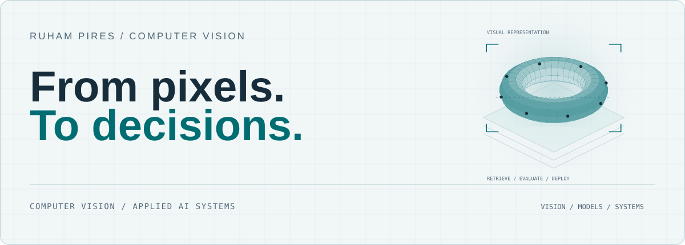

<!-- Generated by scripts/build_profile.py. Edit profile.json. -->
<picture>
  <source media="(max-width: 600px) and (prefers-color-scheme: dark)" srcset="assets/hero-en-dark-mobile.svg">
  <source media="(max-width: 600px) and (prefers-color-scheme: light)" srcset="assets/hero-en-light-mobile.svg">
  <source media="(prefers-color-scheme: dark)" srcset="assets/hero-en-dark.svg">
  
</picture>

# Ruham Pires

**Applied AI Engineer · Computer Vision · GenAI**

English · [Português](README.pt-BR.md)

<a href="#professional-work">Professional work</a> &nbsp; / &nbsp; <a href="#focus">Focus</a> &nbsp; / &nbsp; <a href="#approach">Approach</a> &nbsp; / &nbsp; <a href="#connect">Connect</a>

I work in Data & AI at **Edenred**, with responsibilities in technical leadership and the coordination of applied AI initiatives. My work connects computer vision, multimodal models and the integration of AI capabilities into business applications.

Previously at **TK Elevator**, I developed SnapSupply from concept to deployment. My background in **industrial maintenance, production and automation** shapes how I approach AI: understand the process, define the decision and make the system useful in the field.

## Professional work

### [SnapSupply · AI Part Identification](https://github.com/RuhamPires/ruhampires/blob/main/docs/projects/snapsupply.md)

Computer vision and hybrid search for industrial spare parts. Developed end to end at TK Elevator, with a documented rollout across **12 sites, 3 continents and 5 languages**.

### [SnapClean · Material Data Quality](https://github.com/RuhamPires/ruhampires/blob/main/docs/projects/snapclean.md)

Multilingual matching and human-in-the-loop validation for duplicate, incomplete and inconsistent SAP material records.

### [SnapDispatch · Field Operations](https://github.com/RuhamPires/ruhampires/blob/main/docs/projects/snapdispatch.md)

Technician dispatch combining route optimization, operational scoring and a mobile field workflow.

## Focus

###  Computer vision

Image-to-description validation and visual recognition, with attention to image quality, difficult examples and the limits of automated decisions.

###  Multimodal AI

Connecting images, context and model outputs to operational needs. Making evaluation criteria and integration dependencies explicit.

###  Technical delivery

Aligning technical and business teams around requirements, UAT, application integration, documentation and environment promotion.

**Tools across my work**

<picture><source media="(prefers-color-scheme: dark)" srcset="assets/badge-en-0-dark.svg"></picture>
<picture><source media="(prefers-color-scheme: dark)" srcset="assets/badge-en-1-dark.svg"></picture>
<picture><source media="(prefers-color-scheme: dark)" srcset="assets/badge-en-2-dark.svg"></picture>
<picture><source media="(prefers-color-scheme: dark)" srcset="assets/badge-en-3-dark.svg"></picture>
<picture><source media="(prefers-color-scheme: dark)" srcset="assets/badge-en-4-dark.svg"></picture>
<picture><source media="(prefers-color-scheme: dark)" srcset="assets/badge-en-5-dark.svg"></picture>
<picture><source media="(prefers-color-scheme: dark)" srcset="assets/badge-en-6-dark.svg"></picture>
<picture><source media="(prefers-color-scheme: dark)" srcset="assets/badge-en-7-dark.svg"></picture>

Python · Azure AI · FastAPI · React · Docker · Databricks · Azure DevOps · Vector search

## Engineering notes

A small collection of independent reference material, including a runnable evaluation demo. These examples illustrate engineering concepts using synthetic scenarios.

###  Evaluation lab

`RUNNABLE DEMO`

Measure accepted-decision quality, coverage and human-review rate together. Includes a zero-dependency evaluator, synthetic fixtures and tests.

[Explore the lab →](examples/evaluation-lab/README.md)

###  Visual validation

`REFERENCE DESIGN`

A compact design note on inputs, decision thresholds, difficult examples and the boundary between an automated decision and human review.

[Read the design note →](docs/visual-validation.md)

###  From validation to integration

`DELIVERY NOTE`

A practical outline for acceptance criteria, environment promotion, application integration and meaningful operational monitoring.

[Read the delivery note →](docs/ai-delivery.md)

## Approach

- **Start with the process.** Define the operational decision and the people who depend on it.
- **Evaluate difficult cases.** Consider variation in image quality, context and real usage conditions.
- **Make trade-offs explicit.** Discuss quality, latency, cost and the need for human review together.
- **Document the decision.** Keep assumptions, dependencies and acceptance criteria understandable to the team.

## Background

I started building for the web before specializing in AI. My background spans industrial maintenance, solar energy projects, production and automation, followed by postgraduate training in **Data Science & AI (2025)**. Today I bring those operational and software perspectives to enterprise AI delivery.

I am interested in the practical questions that make AI useful: what should the system decide, how do we know it works, and how does it fit into the operation?

## Connect

[LinkedIn](https://linkedin.com/in/ruhampires)

---

Applied AI · Operational understanding · Technical delivery
