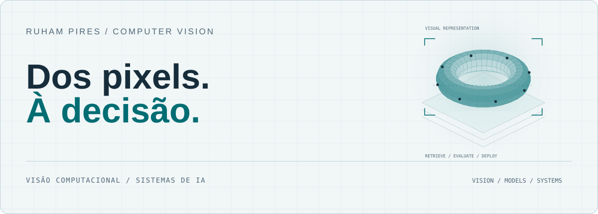

<!-- Generated by scripts/build_profile.py. Edit profile.json. -->
<picture>
  <source media="(max-width: 600px) and (prefers-color-scheme: dark)" srcset="assets/hero-pt-BR-dark-mobile.svg">
  <source media="(max-width: 600px) and (prefers-color-scheme: light)" srcset="assets/hero-pt-BR-light-mobile.svg">
  <source media="(prefers-color-scheme: dark)" srcset="assets/hero-pt-BR-dark.svg">
  
</picture>

# Ruham Pires

**Engenharia de IA Aplicada · Visão Computacional · GenAI**

[English](README.md) · Português

<a href="#projetos-profissionais">Projetos profissionais</a> &nbsp; / &nbsp; <a href="#foco">Foco</a> &nbsp; / &nbsp; <a href="#abordagem">Abordagem</a> &nbsp; / &nbsp; <a href="#contato">Contato</a>

Atuo em Data & AI na **Edenred**, com responsabilidades de liderança técnica e articulação de iniciativas de IA aplicada. Meu trabalho conecta visão computacional, modelos multimodais e a integração de recursos de IA em aplicações de negócio.

Anteriormente, na **TK Elevator**, desenvolvi o SnapSupply da concepção à implantação. Minha trajetória em **manutenção industrial, produção e automação** orienta minha abordagem de IA: compreender o processo, definir a decisão e tornar o sistema útil em campo.

## Projetos profissionais

### Edenred · Dados e IA

**Parts Number**

Extração e padronização de códigos de peças automotivas com apoio de IA.

**Parts Recognition**

Validação visual de peças automotivas a partir das fotografias enviadas.

**Smart Odometer**

Visão computacional para extrair a quilometragem de fotos do painel.

### TK Elevator · Aplicações industriais

**[SnapSupply · AI Part Identification](https://github.com/RuhamPires/ruhampires/blob/main/docs/projects/snapsupply.md)**

Visão computacional e busca híbrida para peças industriais. Desenvolvimento de ponta a ponta na TK Elevator, com implantação documentada em **12 unidades, 3 continentes e 5 idiomas**.

**[SnapClean · Material Data Quality](https://github.com/RuhamPires/ruhampires/blob/main/docs/projects/snapclean.md)**

Matching multilíngue e validação humana para materiais SAP duplicados, incompletos ou inconsistentes.

**[SnapDispatch · Field Operations](https://github.com/RuhamPires/ruhampires/blob/main/docs/projects/snapdispatch.md)**

Despacho de técnicos com otimização de rotas, critérios operacionais e fluxo de trabalho móvel em campo.

### Lens · Produtos próprios e demos

**[LensPart](https://github.com/RuhamPires/ruhampires/blob/main/docs/projects/lenspart.md)**

Busca visual de componentes industriais, com foco em soberania de dados. Como proprietário da LensPart, conecto a direção do produto às necessidades da manutenção industrial. A plataforma documentada inclui identificação visual, deduplicação de catálogos, painéis operacionais e opções de implantação para ambientes industriais.

**[Lens Indústria · Industrial Safety](https://lens-industria.ruhampires.chatgpt.site)**

Demonstração de fábrica 3D interativa que explora visão computacional e identificação de EPIs para segurança industrial.

**[Lens JiuJitsu · Sports Video Analysis](https://lens-jiujitsu.ruhampires.chatgpt.site)**

Tatame 3D interativo e análise de vídeos de Jiu-Jitsu com posições, linha do tempo e apoio à revisão de pontuação.

## Foco

###  Visão computacional

Validação da correspondência entre imagem e descrição e reconhecimento visual, considerando qualidade, casos difíceis e limites das decisões automáticas.

###  IA multimodal

Conexão entre imagens, contexto e respostas dos modelos para apoiar necessidades operacionais. Critérios de avaliação e dependências de integração explícitos.

###  Entrega técnica

Alinhamento entre times técnicos e de negócio sobre requisitos, UAT, integração de aplicações, documentação e promoção entre ambientes.

**Linguagens usadas nos meus projetos**

<picture><source media="(prefers-color-scheme: dark)" srcset="assets/badge-pt-BR-0-dark.svg"></picture>
<picture><source media="(prefers-color-scheme: dark)" srcset="assets/badge-pt-BR-1-dark.svg"></picture>
<picture><source media="(prefers-color-scheme: dark)" srcset="assets/badge-pt-BR-2-dark.svg"></picture>
<picture><source media="(prefers-color-scheme: dark)" srcset="assets/badge-pt-BR-3-dark.svg"></picture>
<picture><source media="(prefers-color-scheme: dark)" srcset="assets/badge-pt-BR-4-dark.svg"></picture>
<picture><source media="(prefers-color-scheme: dark)" srcset="assets/badge-pt-BR-5-dark.svg"></picture>

Python · JavaScript · TypeScript · SQL · Bash · PowerShell

HTML5 e CSS3 complementam o desenvolvimento das interfaces. Bash e PowerShell aparecem em scripts de automação e implantação.

### Tecnologias por área

| Área | Tecnologias |
| --- | --- |
| IA e visão computacional | PyTorch · OpenCLIP · DINOv2 · Multimodal models |
| APIs e backend | FastAPI · Flask |
| Interfaces | React · HTML5 · CSS3 · Tailwind CSS · PWA |
| Dados e busca | FAISS · Azure AI Search · PostgreSQL · SQLite · Cosmos DB |
| Cloud e plataforma | Azure OpenAI · Azure Blob Storage · Databricks |
| Entrega e versionamento | Docker · Git · GitHub Actions · Azure DevOps |

## Notas técnicas

Uma pequena coleção de materiais de referência independentes, incluindo uma demonstração executável de avaliação. Os exemplos ilustram conceitos de engenharia com cenários sintéticos. A documentação técnica está em inglês.

###  Laboratório de avaliação

`DEMO EXECUTÁVEL`

Avaliação conjunta da qualidade das decisões aceitas, cobertura e taxa de revisão humana. Inclui avaliador sem dependências, dados sintéticos e testes.

[Explorar o laboratório →](examples/evaluation-lab/README.md)

###  Validação visual

`DESIGN DE REFERÊNCIA`

Uma nota sobre entradas, critérios de decisão, casos difíceis e a fronteira entre a decisão automática e a revisão humana.

[Ler a nota de design →](docs/visual-validation.md)

###  Da validação à integração

`NOTA SOBRE ENTREGA`

Uma estrutura prática para critérios de aceite, promoção entre ambientes, integração com aplicações e monitoramento operacional.

[Ler a nota sobre entrega →](docs/ai-delivery.md)

## Abordagem

- **Começar pelo processo.** Definir a decisão operacional e as pessoas que dependem dela.
- **Avaliar os casos difíceis.** Considerar variações de qualidade das imagens, contexto e condições reais de uso.
- **Explicitar as escolhas.** Discutir qualidade, latência, custo e necessidade de revisão humana em conjunto.
- **Documentar a decisão.** Manter premissas, dependências e critérios de aceite compreensíveis para o time.

## Trajetória

Comecei desenvolvendo para a web antes de me especializar em IA. Minha trajetória passa por manutenção industrial, projetos de energia solar, produção e automação, seguida pela pós-graduação em **Data Science & IA (2025)**. Hoje conecto essa experiência operacional e de software à entrega de IA corporativa.

Meu interesse está nas perguntas práticas que tornam a IA útil: o que o sistema precisa decidir, como sabemos que funciona e como ele se encaixa na operação?

## Contato

[LinkedIn](https://linkedin.com/in/ruhampires)

---

IA aplicada · Conhecimento operacional · Entrega técnica
