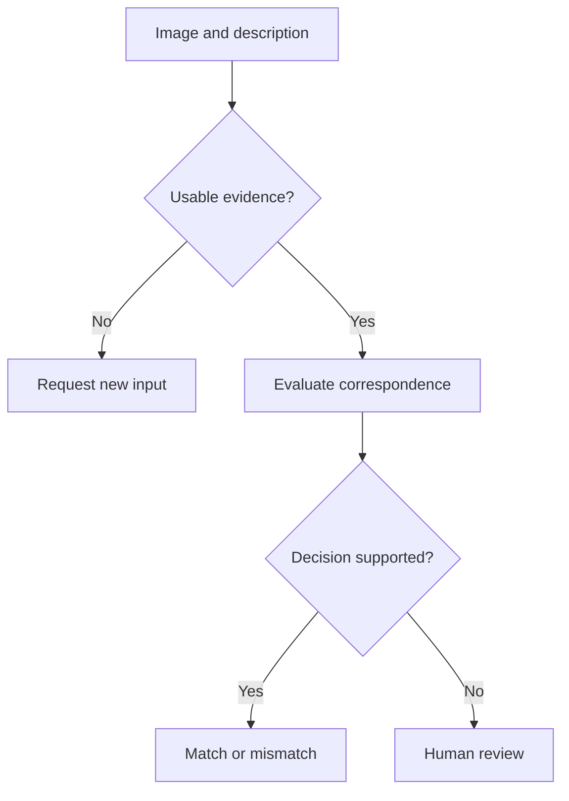

# Visual validation: decisions under imperfect inputs

**Independent reference design.** This note describes an illustrative approach; it is not a disclosure of a corporate implementation or an evaluated production system.

## Decision

Given an image and a claimed product description, determine whether the available evidence supports a match, supports a mismatch, or requires human review.

## Input quality and uncertainty

Image quality and model uncertainty are different concerns. Blur, crop, glare and occlusion can make the relevant visual evidence unavailable. A high-quality image can still show an ambiguous or previously unseen object.

Keep a record of the source of uncertainty. A new image may help with missing visual evidence; an ambiguous product distinction may require additional information or a human specialist.

## Evaluation design

Separate development examples from a frozen test set. Include distinct visual conditions and difficult negative examples. Where several images depict the same physical object, account for that relationship when splitting the data to reduce leakage.

Compare a simple baseline with the proposed approach. Record the exact model and configuration, decision rules and evaluation dataset. Define false acceptance and false rejection in terms of the operational decision.

A score should be described according to how it was produced. Presenting it as a calibrated probability requires appropriate calibration evidence. Choose review rules on development data, then evaluate their consequences on the held-out set.

## The trade-off

A stricter automated-decision rule may increase accuracy among accepted cases while reducing coverage. Report coverage and review rate alongside quality. Inspect whether the system disproportionately routes particular products or visual conditions to review.

The [evaluation lab](../examples/evaluation-lab/README.md) makes these denominators explicit using synthetic decisions. It implements the reporting logic, not the recognition model.

## Practical boundary

Model output should be a structured decision with a reason code and traceable configuration. Applications need to know whether to continue, request a new image, or route the case to review. The final workflow must define who resolves uncertain cases and how corrections inform later evaluation.

[Back to profile](../README.md)
